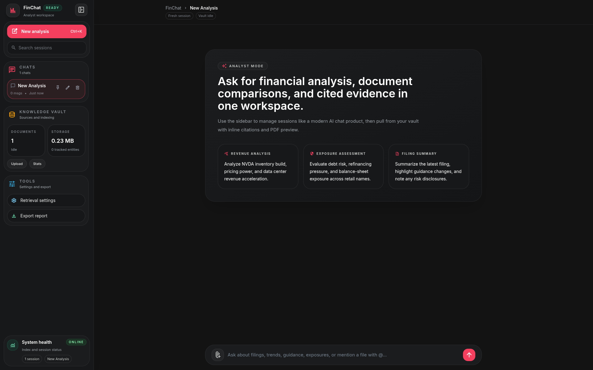
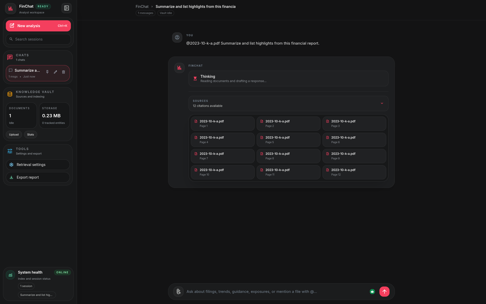
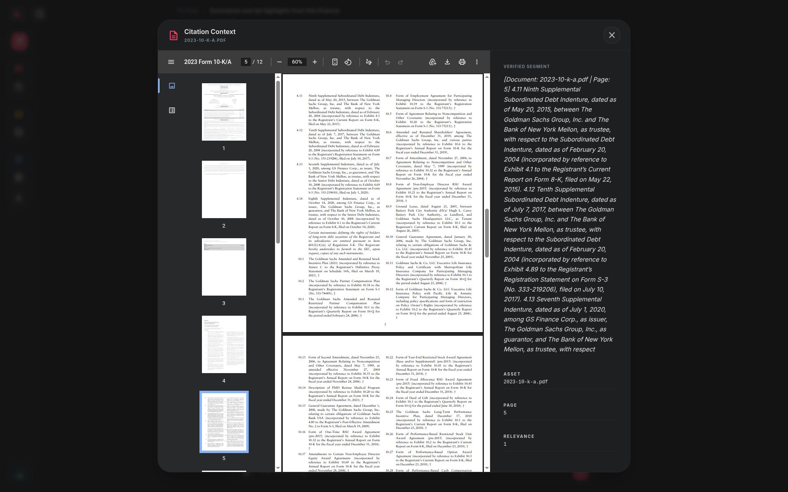
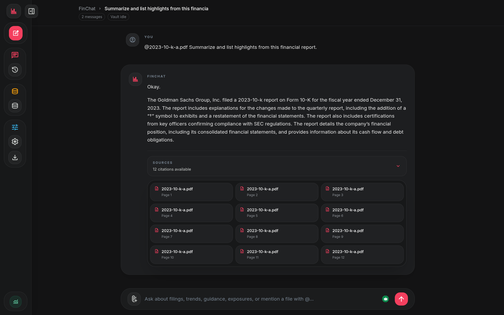
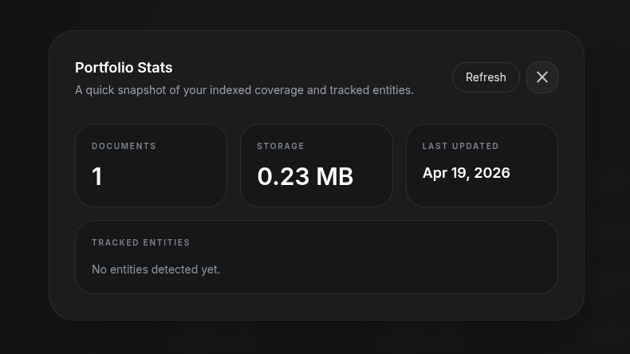

# 📈 FinChat

**Privacy-First · Hybrid Financial Document Search · cited LLM responses**

[](https://fastapi.tiangolo.com)
[](https://python.org)
[](https://github.com/facebookresearch/faiss)
[](https://tailwindcss.com)

---

FinChat is a FastAPI-based Retrieval-Augmented Generation (RAG) workspace specifically tailored for financial PDFs. By combining hybrid dense-sparse retrieval (FAISS + BM25) and cross-encoder reranking, FinChat provides highly accurate answers with precise, page-level inline citations and an interactive in-app PDF preview.

---

## ⚡ Key Features

* **🔍 Hybrid Search Engine**: Combines semantic dense retrieval (via FAISS & `sentence-transformers`) with lexical sparse search (via `BM25`) to capture both conceptual meaning and exact financial terminology.
* **🎯 Cross-Encoder Reranking**: Filters retrieved candidates through a sequence-classification cross-encoder to elevate the most relevant context before passing it to the LLM.
* **📂 Session-Scoped Document Management**: Upload, parse, chunk, and index PDFs dynamically. Files are stored locally and indexed on-the-fly.
* **💬 Citation-Backed Generation**: Every answer includes clickable citations that locate and display the precise source page in the built-in PDF viewer.
* **🧠 Local LLM Integration**: Communicates seamlessly with `llama.cpp` server REST APIs for local, private, and fully offline inference.
* **🎨 Modern Web UI**: Built with responsive Tailwind CSS, providing clean workspace layouts, interactive document selectors, and persistent browser-based chat histories.

---

## 🏗️ System Architecture

```text
               ┌──────────────────────────────┐
               │    Financial PDF Documents   │
               └──────────────┬───────────────┘
                              │ Ingestion
                              ▼
               ┌──────────────────────────────┐
               │     PyPDF Parser & Chunk     │
               └──────────────┬───────────────┘
                              │
                    ┌─────────┴─────────┐
                    ▼                   ▼
      ┌──────────────────────────┐ ┌──────────────────────────┐
      │ Dense Indexing (FAISS)   │ │ Sparse Indexing (BM25)   │
      └─────────────┬────────────┘ └────────────┬─────────────┘
                    │                           │
                    └─────────┬─────────────────┘
                              ▼
               ┌──────────────────────────────┐
               │      Hybrid Retriever        │
               └──────────────┬───────────────┘
                              │ Top-K Candidates
                              ▼
               ┌──────────────────────────────┐
               │   Cross-Encoder Reranking    │
               └──────────────┬───────────────┘
                              │ Best Reranked Chunks
                              ▼
               ┌──────────────────────────────┐
               │    FastAPI Context Merger    │
               └──────────────┬───────────────┘
                              │ Prompt Template
                              ▼
               ┌──────────────────────────────┐
               │  Local LLM (llama.cpp API)   │
               └──────────────┬───────────────┘
                              │ Streaming Response
                              ▼
               ┌──────────────────────────────┐
               │   Tailwind Web Interface     │
               │   (Cited Inline References)  │
               └──────────────────────────────┘
```

---

## 🚀 Setup & Installation

### 1. Clone & Environment Setup
Clone the repository (or your fork) and set up a Python virtual environment:
```bash
git clone https://github.com/kanishk57/finchat.git
cd finchat
python3 -m venv venv
source venv/bin/activate
```

### 2. Install Dependencies
Install all core and NLP dependencies:
```bash
pip install --upgrade pip
pip install -r requirements.txt
```

### 3. Initialize & Start LLM Server
FinChat expects a running `llama.cpp` server (or compatible OpenAI-like local API). Run your local server at `http://localhost:8080` (or configure via `config.py`):
```bash
# Example command to run llama.cpp server
./llama-server -m models/your-llm-model.gguf -c 4096 --port 8080
```

### 4. Run the Application
Execute the startup script:
```bash
chmod +x run.sh
./run.sh
```
Open `http://localhost:8000` in your web browser.

---

## 📸 Interface Preview

Here is the interface breakdown showing document ingestion and cited generation capabilities:

**1. Workspace & Analysis Setup**  


**2. Query Processing**  


**3. Portfolio Stats**  


**4. Retrieved Citations**  


**5. PDF Context Integration**  


---

## 👥 Contributors

* **Armaan Choudhary** - [armaan-choudhary](https://github.com/armaan-choudhary)
* **Kanishk Dhiman** - [kanishk57](https://github.com/kanishk57)
